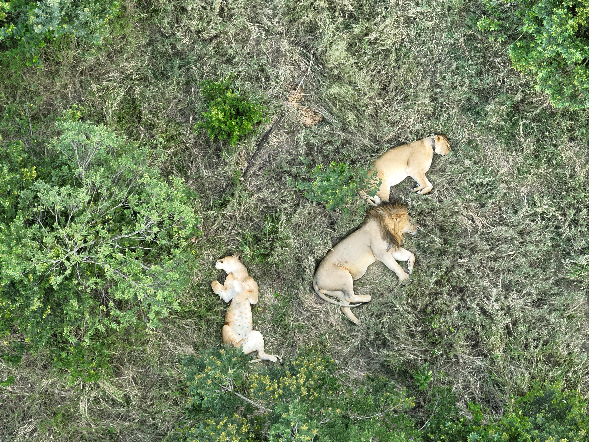

# Drone-based Lion Monitoring 🦁🐾
This repository contains all data and notebooks necessary to reproduce the results of the manuscript "Drone-based aerial monitoring improves demographic accuracy of lion groups with low behavioral impact" (Iannino et al. 2026; currently under review).
Please find more information on the notebooks' content below:

- `ToleranceTest_MasterDoc.xlsx`: The dataset used for all analyses in our study.
- `Initial_data_exploration.ipynb`: Code for the exploratory analyses conducted prior to statistical modeling.
- `Disturbance_models.ipynb`: Code used to generate models regarding drone-induced disturbance of lions.
- `Observability_models.ipynb`: Models comparing ground- vs. drone-based observations of lion pride size and -demographic.

For further questions regarding the manuscript or the code provided here, please reach out to: `eiannino@ab.mpg.de`

  

`